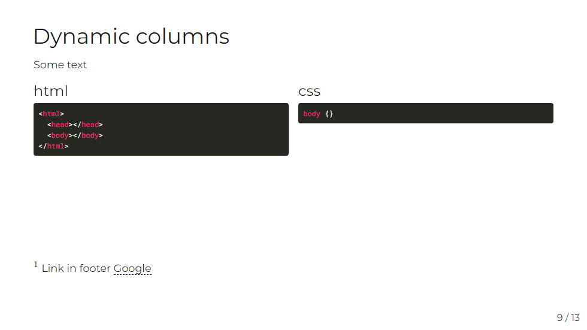
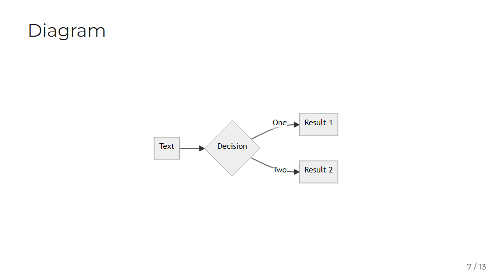
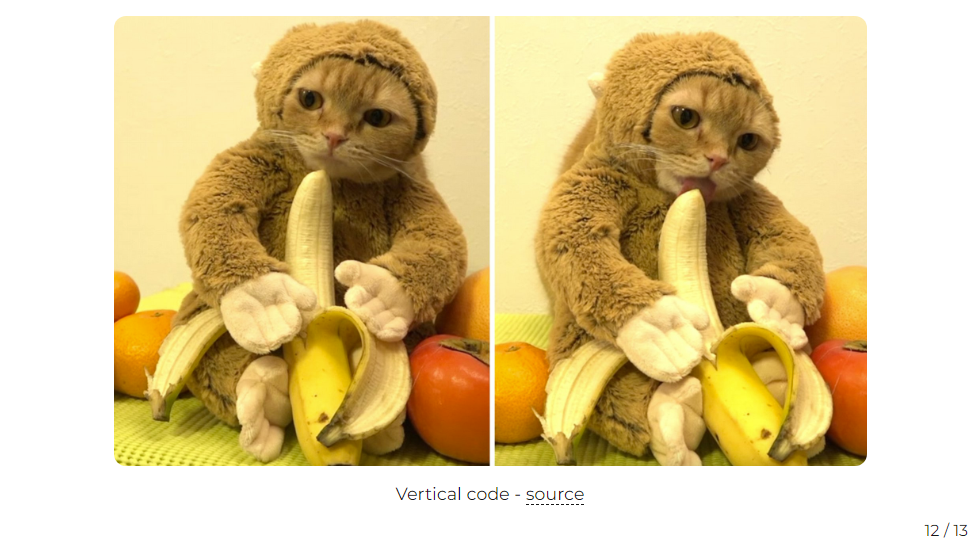
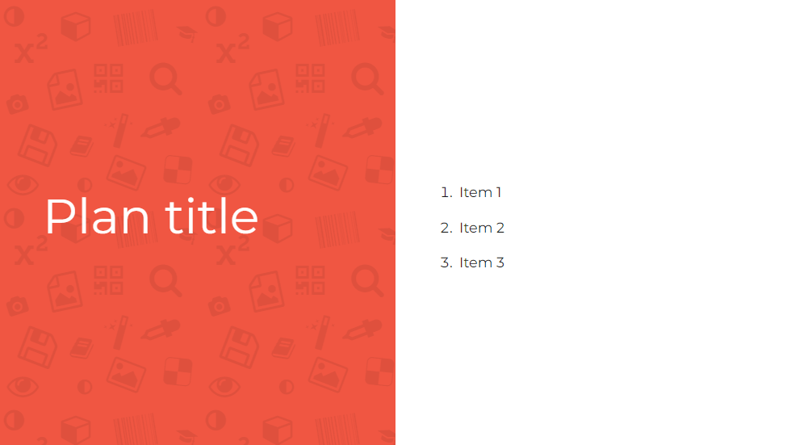

# slidev-theme-imatech

A theme for [Slidev](https://github.com/slidevjs/slidev) in Imatech style.

<!--
  Learn more about how to write a theme:
  https://sli.dev/themes/write-a-theme.html
--->

<!--
  run `npm run dev` to check out the slides for more details of how to start writing a theme
-->

<!--
  Put some screenshots here to demonstrate your theme

  Live demo: [...]
-->

## Install

Add the following frontmatter to your `slides.md`. Start Slidev then it will prompt you to install the theme automatically.

<pre><code>---
theme: <b>imatech</b>
---</code></pre>

Learn more about [how to use a theme](https://sli.dev/themes/use).

## Layouts

This theme provides the following layouts:

### auto-col

props: colNumber

You can use named slots to create columns.

### diagran

Layout allows to show mermaid diagram in the middle.

### figure

Show figure with caption. Object-fit: contain is used to make images responsive.

### intro

props: introName, introDate, introTitle, introSubtitle

First slide with information about topic, date and author.

### plan

Split screen to show plan of lecture. Layout uses named slot.

### pre-end

Last slide for QA session.

### section

New section title.

## Components

This theme provides the following components:

### global-bottom

This component adds slide number to right bottom corner to default, auto-col, diagram, center, figure layouts.

## Contributing

- `npm install`
- `npm run dev` to start theme preview of `example.md`
- Edit the `example.md` and style to see the changes
- `npm run export` to generate the preview PDF
- `npm run screenshot` to generate the preview PNG
