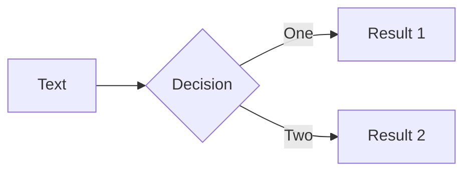

---

# What is Slidev?

Slidev is a slides maker and presenter designed for developers, consist of the following features

- 📝 **Text-based** - focus on the content with Markdown, and then style them later
- 🎨 **Themable** - theme can be shared and used with npm packages
- 🧑‍💻 **Developer Friendly** - code highlighting, live coding with autocompletion
- 🤹 **Interactive** - embedding Vue components to enhance your expressions
- 🎥 **Recording** - built-in recording and camera view
- 📤 **Portable** - export into PDF, PNGs, or even a hostable SPA
- 🛠 **Hackable** - anything possible on a webpage

<br>
<br>

Read more about [Why Slidev?](https://sli.dev/guide/why)

---
layout: section
---

# New section

---

# Introduction

Theme for lecture slides

- Includes page numbers for default-layout pages
  - List item examples
  - Inline ` code ` example
- Has modified list spacing for clear lecture slides
  - Top-level bullets are spaced apart to get the main concepts across
  - Sub-lists are more tightly packed to keep related content together

---
layout: iframe
url: https://codepen.io/t_afif/embed/BaYXdmM?default-tab=html%2Cresult
---

---

# Navigation

Hover on the bottom-left corner to see the navigation's controls panel

### Keyboard Shortcuts

|     |     |
| --- | --- |
| <kbd>space</kbd> / <kbd>tab</kbd> / <kbd>right</kbd> | next animation or slide |
| <kbd>left</kbd>  / <kbd>shift</kbd><kbd>space</kbd> | previous animation or slide |
| <kbd>up</kbd> | previous slide |
| <kbd>down</kbd> | next slide |

---
layout: diagram
---

# Diagram

::diagram::



---
layout: plan
---

# Plan title

::plan::

1. Item 1
1. Item 2
1. Item 3

---
layout: auto-col
colNumber: 2
---

# Dynamic columns

Some text

::autoCol1::

### html

```html
<html>
  <head></head>
  <body></body>
</html>
```

::autoCol2::

### css

```css
body {}
```

::footer::

$^1$ Link in footer [Google](//google.com)

---

# Links

1. [Google](//google.com)
1. [Yandex](//ya.ru)
1. [Bing](//bing.com)

---
layout: center
class: "text-center"
---

# Learn More

[Documentations](https://sli.dev) / [GitHub Repo](https://github.com/slidevjs/slidev)

---
layout: figure
imgUrl: monkey.png
---

Vertical code - [source](google.com)

---
layout: pre-end
---